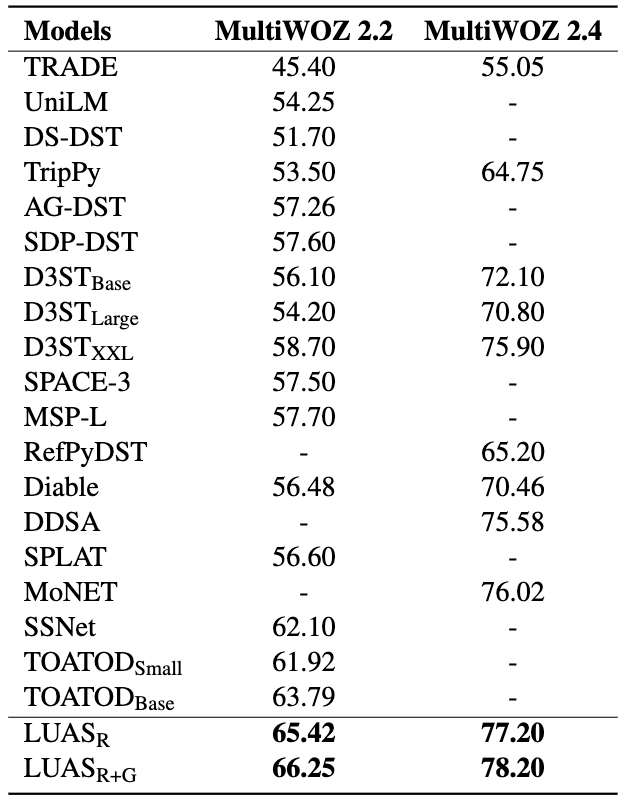

# Enhancing Dialogue State Tracking Models through LLM-backed User-Agents Simulation

This repository contains the official `PyTorch` implementation of the paper: Cheng Niu, Xingguang Wang, Xuxin Cheng, Juntong Song, Tong Zhang.

If you use any source codes or the datasets included in this toolkit in your work, please cite the following paper. The bibtex are listed below:

<pre>
@misc{niu2024enhancing,
      title={Enhancing Dialogue State Tracking Models through LLM-backed User-Agents Simulation}, 
      author={Cheng Niu and Xingguang Wang and Xuxin Cheng and Juntong Song and Tong Zhang},
      year={2024},
      eprint={2405.13037},
      archivePrefix={arXiv},
      primaryClass={cs.CL}
}
</pre>


In the following, we will guide you how to use this repository step by step.

## Architecture


## Results



## Preparation

Our code is based on PyTorch 2.0.1 Required python packages:

```shell
pip install -r requirements.txt
```


## How to run it

```Shell
# Generate New Data
cd generation/multiwoz
python run.py # or bash run.sh batched 

# prepare real data
# see generation/converters/README.md

# Achieve Two-Stage Training
bash train.sh

# Evaluation
# see eval/README.md
```
You can directly use our generated data:

```Shell
./generation/multiwoz/datas/multiwoz.json
```

